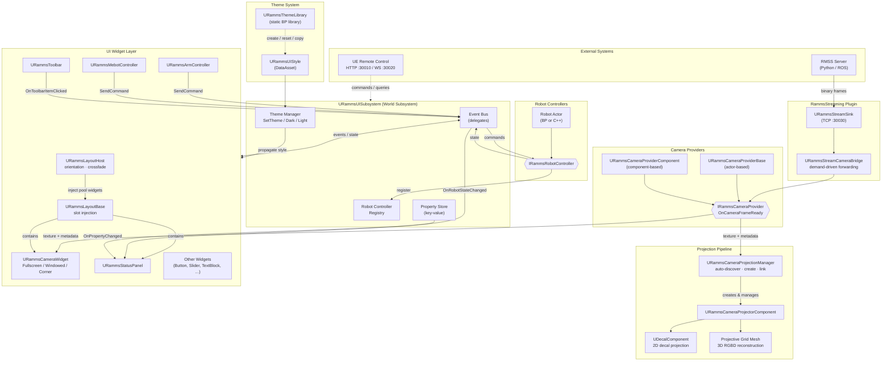

# RammsUI

Core UI plugin for the **RAMMP** robotics project, built on Unreal Engine 5.7. Provides a full widget library, camera visualization pipeline, GPU-accelerated 3D projection (PGM), robot command dispatch, orientation-aware layout management, a data-asset theme system, and a central event bus.

**Depends on:** [RammsStreaming](../RammsStreaming) (bridges external RMSS streams into the camera pipeline).

## Architecture



### Data flow summary

| Path | Flow |
|---|---|
| **Camera frames** | RMSS → StreamSink → Bridge → `IRammsCameraProvider` → CameraWidget (2D) / ProjectionManager (3D) |
| **Robot commands** | Widget → `URammsUISubsystem` → `IRammsRobotController` actor |
| **Robot state** | Controller → `OnRobotStateChanged` → StatusPanel / any subscriber |
| **Theme changes** | `SetTheme()` → subsystem propagates to all live `URammsBaseWidget` instances |
| **Layout transitions** | `URammsLayoutHost` detects orientation or receives request → crossfade → reparent pool widgets |
| **Remote control** | HTTP/WS → UE Remote Control API → `URammsRemoteBridge` → subsystem / widgets |

## Port Assignments

| Service | Port |
|---|---|
| UE Remote Control HTTP | 30010 |
| UE Remote Control WebSocket | 30020 |
| RMSS Binary Streaming | 30030 |

---

## Camera System

Provider → Widget → Display architecture with demand-driven data forwarding.

```
Internal:   URammsCameraProviderBase ──► URammsCameraWidget ──► Display Mode
External:   RMSS Stream ──► URammsStreamCameraBridge ──► IRammsCameraProvider ──► URammsCameraWidget
```

| Class | Role |
|---|---|
| `IRammsCameraProvider` | Interface — any actor can provide camera frames via `OnCameraFrameReady` |
| `URammsCameraProviderBase` | Actor-based provider with socket and transform support |
| `URammsCameraProviderComponent` | Actor component implementing `IRammsCameraProvider` |
| `URammsStreamCameraBridge` | Bridges an RammsStreaming sink → `IRammsCameraProvider`; demand-driven raw-data forwarding, auto-registers streams with intrinsics/extrinsics metadata |
| `URammsCameraWidget` | Display widget — **Fullscreen / Windowed / Corner** modes, aspect-ratio maintenance, collapsible header, drag-to-move, multi-view (RGB / Data / SideBySide / Overlay), material-based data visualization |

---

## 2D Projection — Deferred Decal

Real-time camera-feed projection onto scene surfaces using Deferred Decals.

| Class | Role |
|---|---|
| `URammsCameraProjectorComponent` | Per-camera projector — internal `UDecalComponent` driven by projection material |
| `URammsCameraProjectionManager` | Auto-discovers providers, creates projectors, links depth streams, propagates settings |

### How it works

1. **Provider discovery** — Manager scans for `IRammsCameraProvider` actors and components on `BeginPlay` + deferred timer.
2. **Projector creation** — One `URammsCameraProjectorComponent` per color stream. Depth-only streams are linked to color projectors but never get their own decal.
3. **Decal rendering** — Each projector creates a `UDecalComponent` positioned at the camera extrinsic (world pose). The frustum extent is computed from intrinsics and `MaxProjectionDistance`.
4. **Material reprojection** — The deferred decal material (`RammsProjection.ush`) samples the camera texture and reprojects it into world space using the camera intrinsics and pose vectors.
5. **Stencil masking & edge fade** — Per-projector stencil value and UV-space edge fade prevent bleeding.

### Material parameters

| Parameter | Type | Description |
|---|---|---|
| `CameraTexture` | Texture | Current video frame |
| `Intrinsics` | Vector4 | `(fx, fy, cx, cy)` — camera calibration in pixels |
| `ImageSize` | Vector4 | `(width, height, 0, 0)` |
| `CameraWorldPos` | Vector3 | Extrinsic world position |
| `CameraForward` / `CameraRight` / `CameraUp` | Vector3 | Extrinsic orientation axes |
| `FadeWidth` | Scalar | Normalized edge fade `[0..0.5]` |
| `TargetStencil` | Scalar | Scene stencil mask (0 = no filtering) |

### Manager configuration

| Property | Default | Description |
|---|---|---|
| `ProjectionMaterial` | — | Deferred Decal material (Translucent) |
| `bAutoCreateProjectors` | `true` | Auto-discover providers and create projectors |
| `bSkipDepthStreams` | `true` | Don't create decal projectors for depth-only streams |
| `ExcludeStreamIDs` | — | Stream IDs to skip |
| `DefaultMaxDistance` | 5000 cm | Frustum max depth |
| `DefaultFadeWidth` | 0.05 | Edge fade (5%) |
| `DefaultTargetStencil` | 200 | Decal stencil value |

### Depth stream auto-linking

RMSS convention: depth stream channel = color channel + 100 (e.g. `stream/0` → `stream/100`). The manager automatically discovers, starts, and links depth streams to the corresponding color projector.

---

## 3D Projection — Projective Grid Mapping (PGM)

Real-time RGBD point-cloud reconstruction projected into the 3D viewport.

| Class | Role |
|---|---|
| `URammsCameraProjectorComponent` | Per-camera projector with two rendering paths (see below) |
| `URammsCameraProjectionManager` | Manages multiple projectors — auto-discovers providers, propagates settings, dynamic projector creation |

### GPU mode (default, `bGPUAccelerated = true`)

Static grid mesh + World Position Offset material reads the depth texture and deprojects vertices in the vertex shader via `RammsPGM.ush`. No CPU readback.

### CPU mode (fallback)

Per-frame vertex position + color computation from raw RGBD data on the CPU.

### `RammsPGM.ush` shader

Deprojection from depth, parallax-corrected RGB UV lookup, NaN degenerate-vertex collapse, neighbor edge-stretch check.

**Material parameters:** `DepthTexture`, `CameraTexture`, `PGMIntrinsics`, `PGMImageSize`, `PGMDepthConfig`, `PGMParallax`, `PGMColorIntrinsics`, `PGMGridStep`.

**Projector properties:** `Decimation`, `SensorBaselineY`, `MaxEdgeStretchCM`, `DepthScaleToCM`, `MinDepthCM` / `MaxDepthCM`, `SyncThresholdMS` for frame synchronization.

---

## Layout System

Orientation-aware layout management with crossfade transitions and a shared widget pool.

### `URammsLayoutHost` — root widget

- **Widget pool:** shared `URammsBaseWidget` instances are reparented into the active layout's `NamedSlot` containers on every transition.
- **Orientation detection:** auto-detects portrait / landscape from viewport aspect ratio.
- **Pair mapping:** `PortraitLayoutMap` (`TMap<FName, FName>`) + suffix fallback (`_Portrait` / `_Landscape`) for orientation variants.
- **Crossfade:** overlay-based animated transition (`CrossfadeDuration`, default 0.3 s).

```cpp
enum class ERammsOrientationOverride { Auto, ForceLandscape, ForcePortrait };
```

| Delegate | Signature |
|---|---|
| `OnLayoutTransitionStarted` | `(FName NewLayout, FName PreviousLayout)` |
| `OnLayoutTransitionCompleted` | `(FName NewLayout, FName PreviousLayout)` |
| `OnOrientationChanged` | `(ERammsOrientation NewOrientation)` |

### `URammsLayoutBase` — layout base class

Abstract base for individual layouts. Auto-discovers injection slots (`NamedSlot`, `Overlay`, `SizeBox`) via `DiscoverSlots()`. Provides `InjectWidget()`, `ClearSlot()`, and `RequestLayoutTransition()`.

---

## Theme System

Centralized styling via `UDataAsset`.

### `URammsUIStyle`

| Struct | Contents |
|---|---|
| `FRammsColorPalette` | Primary, Secondary, Background, Surface, Text (Primary/Secondary/Disabled), Border, Success, Warning, Error, Info |
| `FRammsTypography` | HeadingLarge/Medium/Small, Body, Caption, Monospace (`FSlateFontInfo`) |
| `FRammsSpacing` | XSmall (2) → XXLarge (32) |
| `FRammsBorderStyle` | Border widths, corner radii (Small / Medium / Large) |
| `FRammsScrollBarStyle` | Thickness, corner radius, thumb/track colors, padding |
| `FRammsSliderStyle` | Thumb size, bar thickness, active/inactive/hover colors |
| `FRammsCheckBoxStyle` | Size, corner radius, checked/unchecked/hover/border colors, check mark color |
| `FRammsAnimationCurve` | Duration, easing (`ERammsUIEasing`), delay — presets for fade, slide, scale, expand/collapse |

**Built-in themes:** `CreateDefaultDarkTheme()` / `CreateDefaultLightTheme()`.

### Theme asset utilities — `URammsThemeLibrary`

Static Blueprint Function Library (no world context needed — usable from Editor Utility Widgets):

| Function | Description |
|---|---|
| `CreateDarkThemeAsset(AssetPath)` | Save a new DataAsset pre-filled with dark defaults |
| `CreateLightThemeAsset(AssetPath)` | Save a new DataAsset pre-filled with light defaults |
| `DuplicateThemeAsAsset(Source, AssetPath)` | Clone any theme to a new DataAsset |
| `CopyTheme(Source, Target)` | Copy all values from one theme into another |

Instance methods on `URammsUIStyle`: `ResetToDarkDefaults()`, `ResetToLightDefaults()`, `CopyFrom(Source)`.

### Theme propagation

`URammsUISubsystem` owns the current theme. `SetTheme()` / `SetDarkTheme()` / `SetLightTheme()` fire `OnThemeChanged` and propagate to every live widget. Widgets auto-apply the subsystem theme in `NativeConstruct` when no explicit style is set (`bAutoApplyStyle`).

---

## UI Widgets

All widgets inherit from **`URammsBaseWidget`** (`UUserWidget`), which provides:

- Style application + child propagation
- Animation helpers: `FadeIn/Out`, `SlideIn/Out`, `ScaleIn/Out` with `ERammsUIEasing`
- Robot controller auto-resolution via `URammsUISubsystem`
- Programmatic widget-tree construction (`BuildWidgetTree()`)

### Widget catalogue

| Widget | Description |
|---|---|
| `URammsButton` | Variant-driven button: **Primary / Secondary / Success / Warning / Error / Ghost** |
| `URammsSlider` | Styled numeric slider, themed via `FRammsSliderStyle` |
| `URammsCollapsibleContainer` | Animated expand/collapse container with styled header |
| `URammsStatusPanel` | Data-driven status table with `FRammsStatusField` rows — per-field source (RobotState / PropertyStore / Custom), format, threshold coloring, animated collapse |
| `URammsToolbar` | Horizontal / Vertical toolbar with `FRammsToolbarItem`, per-item toggle state |
| `URammsAxisControl` | Per-axis slider with `FRammsAxisConfig`, ± increment buttons, reset |
| `URammsJoystickWidget` | 2D joystick input for movement commands |
| `URammsRadioButton` | Mutual-exclusion radio group, themed checkboxes via `FRammsCheckBoxStyle` |
| `URammsTextBlock` | Themed text block — variant (`HeadingLarge` … `Monospace`), color mode (`Primary` / `Secondary` / `Accent` / `Custom` / …), auto-updates on theme change |
| `URammsImageButton` | Icon button with image background |
| `URammsNotificationWidget` | Single toast notification with severity level |
| `URammsNotificationContainer` | Viewport container that stacks and auto-dismisses notifications |
| `URammsPanel` | Simple styled container panel |
| `URammsArmController` | Kinova Gen3 7-joint arm control widget |
| `URammsMebotController` | MEBot motor control widget |
| `URammsArmTaskWidget` | Arm task selection UI |
| `URammsTaskWidget` | General task selection UI |
| `URammsSeatController` | Seat axis adjustment controls |
| `URammsLayoutHost` | Root layout manager (see [Layout System](#layout-system)) |
| `URammsLayoutBase` | Layout base class (see [Layout System](#layout-system)) |
| `URammsLayoutManager` | Legacy responsive layout component |

---

## Event Bus — `URammsUISubsystem`

`UWorldSubsystem` acting as the central event hub.

### Robot controller registry

Auto-discovery: actors implementing `IRammsRobotController` register/unregister via `RegisterRobotController()` / `UnregisterRobotController()`. Query with `FindRobotController()`, `FindRobotControllerByName()`, `GetAllRobotControllers()`.

### Typed event delegates

| Delegate | Payload |
|---|---|
| `OnTaskAction` | `ERammsTaskAction` |
| `OnArmTaskChanged` | `ERammsArmTask NewTask, ERammsArmTask PreviousTask` |
| `OnRobotStateChanged` | `const FRammsRobotState&` |
| `OnSeatStateChanged` | `ERammsSeatAxis, float` |
| `OnToolbarItemClicked` | `FName ItemID` |
| `OnToolbarToggle` | `FName ItemID, bool bIsActive` |
| `OnOverlayToggle` | `ERammsOverlayType, bool bVisible` |
| `OnVisualizationLayerToggle` | `ERammsVisualizationLayer, bool bEnabled` |
| `OnHighlight` | `ERammsHighlightTarget, bool bHighlighted, FLinearColor` |
| `OnLayoutTransitionRequest` | `FName LayoutName, bool bAnimated` |
| `OnCustomUIEvent` | `const FRammsUIEvent&` (rich payload — see below) |
| `OnPropertyChanged` | `FName Key, const FString& Value` |
| `OnRobotCommandSent` | `FName CommandName, bool bAccepted` |
| `OnThemeChanged` | `URammsUIStyle* NewStyle` |

### Custom events — `FRammsUIEvent`

Rich payload struct: `EventName`, typed fields (`bEnabled`, `FloatValue`, `IntValue`, `ColorValue`, `VectorValue`, `StringValue`), an `FInstancedStruct StructPayload`, and a `TMap<FName, FString> Properties` bag with typed getters (`GetPayloadFloat`, `GetPayloadBool`, …).

### Key-value property store

`SetProperty()` / `GetProperty()` with typed convenience: `GetPropertyAsFloat()`, `GetPropertyAsInt()`, `GetPropertyAsBool()`, `GetPropertyAsByte()`. Changes fire `OnPropertyChanged`.

### Robot command dispatch

| Method | Scope |
|---|---|
| `SendRobotCommand(FName)` | First registered controller |
| `SendRobotCommandWithValue(FName, uint8)` | First registered controller |
| `SendRobotCommandWithPayload(FName, FInstancedStruct)` | First registered controller |
| `BroadcastRobotCommand(FName)` | All controllers |
| `BroadcastRobotCommandWithValue(FName, uint8)` | All controllers |
| `BroadcastRobotCommandWithPayload(FName, FInstancedStruct)` | All controllers |

### Layout & theme management

`BroadcastLayoutTransitionRequest(FName, bool bAnimated)` — triggers `OnLayoutTransitionRequest`.
`SetTheme()` / `SetDarkTheme()` / `SetLightTheme()` — see [Theme System](#theme-system).

---

## Interfaces

| Interface | Purpose |
|---|---|
| `IRammsCameraProvider` | Camera frame source (`OnCameraFrameReady`) |
| `IRammsRobotController` | Robot command sink — `SendCommand`, `SendCommandWithValue`, `SendCommandWithPayload`, arm/MEBot/seat control, state queries. Full C++ / Blueprint polymorphism via `BlueprintNativeEvent`. |
| `IRammsStateProvider` | Robot state source |
| `IRammsDataSource` | Generic data source |
| `IRammsCommandSink` | Generic command sink |

---

## Shaders

| File | Purpose |
|---|---|
| `/RammsUI/Private/RammsPGM.ush` | GPU PGM deprojection, parallax-corrected UV, degenerate-vertex collapse, edge-stretch check |
| `/RammsUI/Private/RammsRoundedCorners.ush` | SDF-based rounded-corner masking |
| `/RammsUI/Private/RammsProjection.ush` | Camera projection utilities |
| `/RammsUI/Private/RammsOutline.usf` | Outline post-process effect |
| `/RammsUI/Private/RammsOutlineCommon.ush` | Shared outline utilities |

---

## Usage Examples (C++)

### 1. Subscribing to events

```cpp
URammsUISubsystem* UI = GetWorld()->GetSubsystem<URammsUISubsystem>();

// Robot state changes
UI->OnRobotStateChanged.AddDynamic(this, &AMyActor::HandleRobotState);

// Toolbar toggle
UI->OnToolbarToggle.AddDynamic(this, &AMyActor::HandleToolbarToggle);

// Custom events with typed payload
UI->OnCustomUIEvent.AddDynamic(this, &AMyActor::HandleCustomEvent);
```

### 2. Switching themes at runtime

```cpp
URammsUISubsystem* UI = GetWorld()->GetSubsystem<URammsUISubsystem>();

// Built-in presets
UI->SetDarkTheme();
UI->SetLightTheme();

// Custom theme data asset
UI->SetTheme(MyCustomStyleAsset);

// React to changes
UI->OnThemeChanged.AddDynamic(this, &AMyHUD::OnThemeSwitch);
```

### 3. Registering a layout with orientation variants

```cpp
URammsLayoutHost* Host = /* your layout host widget */;

// Register two layouts
Host->AddLayout(UMyDriveLayout::StaticClass(), TEXT("Drive"));
Host->AddLayout(UMyArmLayout::StaticClass(),   TEXT("Arm"));

// Map portrait orientation variants
Host->PortraitLayoutMap.Add(TEXT("Drive"), TEXT("Drive_Portrait"));
Host->PortraitLayoutMap.Add(TEXT("Arm"),   TEXT("Arm_Portrait"));

// Add shared widgets to the pool — they follow the active layout
Host->AddPoolWidget(TEXT("CameraFeed"), MyCameraWidget);
Host->AddPoolWidget(TEXT("StatusBar"),  MyStatusPanel);

// Transition with crossfade
Host->TransitionToLayout(TEXT("Drive"), /*bAnimated=*/ true);
```

### 4. Sending a robot command

```cpp
URammsUISubsystem* UI = GetWorld()->GetSubsystem<URammsUISubsystem>();

// Simple command
UI->SendRobotCommand(TEXT("EStop"));

// Command with value
UI->SendRobotCommandWithValue(TEXT("SetSpeed"), 3);

// Command with struct payload (broadcast to all controllers)
FInstancedStruct Payload;
Payload.InitializeAs<FMyWaypointData>(TargetLocation, Tolerance);
UI->BroadcastRobotCommandWithPayload(TEXT("NavigateTo"), Payload);
```

---

## Remote Control

| Class | Description |
|---|---|
| `URammsRemoteBridge` | Static function library for UE Remote Control API integration — widget discovery, status panel updates, and notification dispatch |

---

## License

See [LICENSE](LICENSE) in this directory.
